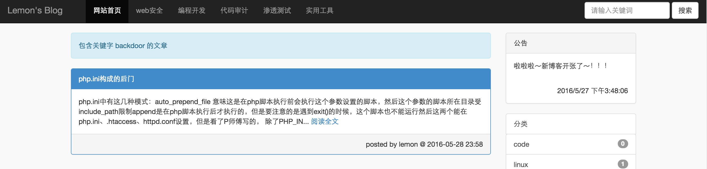

### 前言
算是在完成作业的前提下花了6天弄完，功能少而且存在大量bug以及安全问题，主要是练习mvc框架的构思，也算是第一次从前端设计到框架构写再到后端逻辑处理。记录一下遇到的坑点。

前端：bootstrap + jquery

后端：php

数据库：mysql

开发时的运行环境：phpstudy + windows

### 网站样貌
首页：


文章：


搜索：


后台：


### mvc设计
大概思想：
index.php进行路由转发，分配到指定的控制器并实例化以及其控制器方法。

controller层：
一旦实例化就new一个view
还有一个model方法，也就是在controller进行数据库连接的时候需要它


view层：
主要是实现assign、display
assign也就是变量往html模版发送变量
display就是将html最后显示出来

model层：
进行数据连接，操作，等等。


### 数据库
##### 数据库设计
评论：
主键：article article_id
外键：message article_id

类别：
主键：category category_id
外键：article category_id

作者：
主键：admin name
外键：article name

数据库遇上一个编码问题：

连接数据库之前有：`set names utf8;`
却还是中文乱码

创建数据库之前就应该：

```
CREATE DATABASE `test`
CHARACTER SET 'utf8'
COLLATE 'utf8_general_ci';
```

如果是像我一样已经创建过的话，
查看默认的编码哪些有问题：`show variables like "%char%"`

因为默认的是`latin1`
如果字段`latin1_swedish_ci`，就需要改成`utf8_general_ci`

##### sql语句问题
想实现一个每个分类有多少文章，左连接是有一个情况的，如果连接的表没有数据，会将字段以null值填写，这时如果分类没有文章的话，`count(*)`是会返回1的。

```
SELECT category,count(*) as num FROM `category` left join article on category.category_id = article.category_id group by category;
```
正确姿势应该是`count(article_id)`一个可能为null字段，count(null) = 0

```
SELECT category.category,count(article.article_id) as num FROM `category` left join `article` on category.category_id = article.category_id group by category;
```

### 页面实现
由于是在view层，一开始并没有想到怎么好好的去处理一下侧栏的数据，它们在几个页面都有用到，然而不可能在控制器中的每个方法都写一次数据交互。

1、弄一个模版，最后include进去

2、做一个api，然后再用ajax去获取，jquery去操作dom实现。

第一条开始没想通，然后就舍近求远的实现了第二条。

### 功能实现
##### 后台富文本
本来是想使用markdown引擎，无奈考试快来了，只能快点写完，简化了很多，直接post内容。
div有一个`contentEditable=true`属性，可以直接实现富文本，也就是从网上复制内容的时候，会保留其原有的html格式。

```
<form id="testform" action="" method="post">
<div contentEditable=true style="height:300px;width:400px" id="content" placeholder="填写内容....."></div>
<input type="text" name="content" id="test" style="display:none"/>
<input type="submit" value="发表"/>
</form>
```

div的name值，form提交后是收不到的值的，所以可以在submit之前，将div里面的内容弄到一个表单标签再发送就好。

```
<script type="text/javascript">
	$("#testform").submit(function(e){
		e.preventDefault();
		$("#test").val($("#content").html());
		e.target.submit();
	});
</script>
```
其中`e.preventDefault();`是需要的，因为把div数据放到input之前需要阻塞一下表单的发送。

文章的数据处理：

进库处理：

```
$content = htmlspecialchars(addslashes($_POST['content']));
```
出库处理：

```
htmlspecialchars_decode($content);
```
文章摘要处理：

```
mb_strimwidth(strip_tags(htmlspecialchars_decode($v->content)),0,404,'...');
```